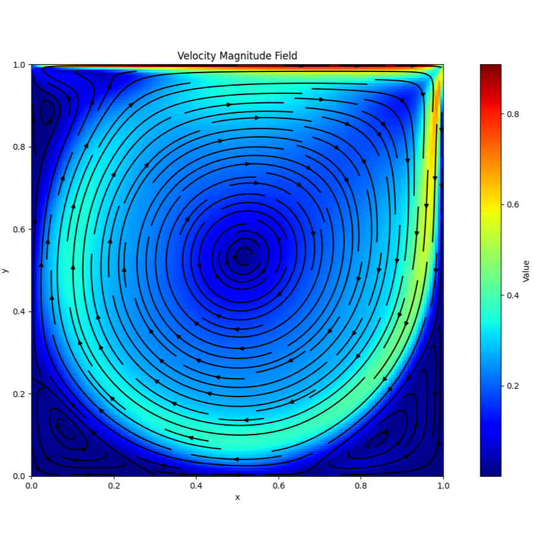
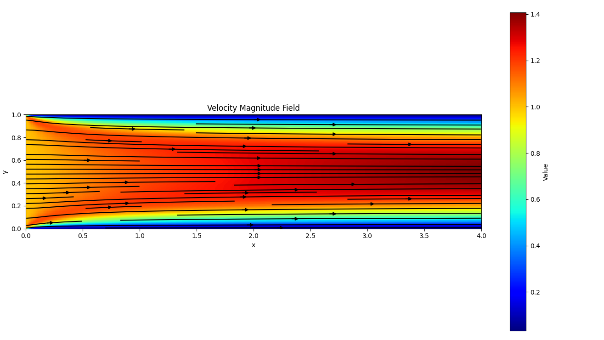
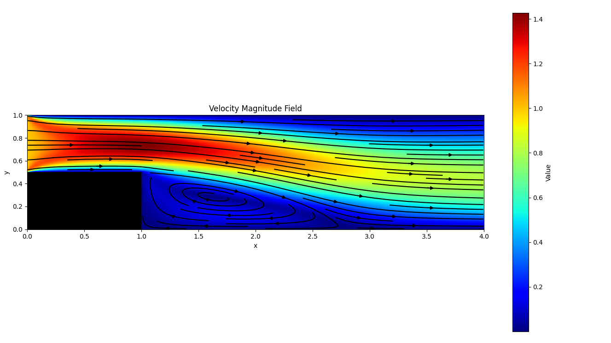
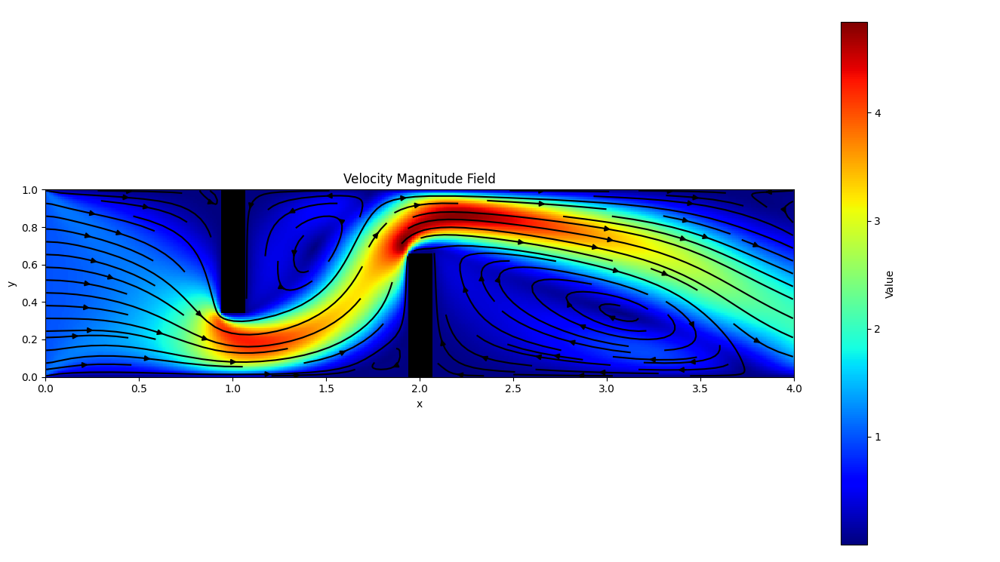

# cfd

This project serves as part of my BSc thesis in Computer Science. It is a CFD (Computational Fluid Dynamics) solver for
the 2D incompressible Navier-Stokes equations. The solver is based on the SIMPLE
algorithm for pressure-velocity coupling, solved in an orthogonal cartesian colocated grid. The simulation is written in
C++, while the visualizations are written in Python.

## Equations

Equations being discretized and solved using the Finite Volume Method (FVM) in 2D:

- Incompressible Navier Stokes

$$
\begin{aligned}
    \begin{cases}
        \large \nabla \cdot \vec{v} = 0 \\ \\
        \large \rho \bigg[ \dfrac{\partial \vec{v}}{\partial t} + (\vec{v} \cdot \nabla)\vec{v} \bigg] = -\nabla p + \mu \nabla^2\vec{v}
    \end{cases}
\end{aligned}
$$

- Convection - Diffusion

$$
\begin{aligned}
    \large \dfrac{\partial \vec{v}}{\partial t} + (\vec{v} \cdot \nabla)\vec{v} = \mu \nabla^2\vec{v}
\end{aligned}
$$

- Single Convection - Diffusion

$$
\begin{aligned}
    \large \dfrac{\partial \phi}{\partial t} + (\vec{v} \cdot \nabla)\phi = \Gamma \nabla^2\phi
\end{aligned}
$$

- Diffusion

$$
\begin{aligned}
    \large \dfrac{\partial \phi}{\partial t} = \Gamma \nabla^2 \phi
\end{aligned}
$$

## Gallery

- Lid-driven cavity  
  
- Pipe  
  
- Backward-facing step  
  
- Pipe with obstacles  
  
- Von Karman  
  
- Kelvin-Helmholtz  
  

## Features

### Creating simulations

- 2D Simulations (both steady and unsteady)
    - Incompressible Navier Stokes (using the SIMPLE algorithm)
    - Convection - Diffusion
    - Single Convection - Diffusion
    - Diffusion
- Boundary conditions
    - Velocity inlet
    - Fixed pressure
    - No-slip wall
    - Slip wall
    - Moving wall
    - Periodic
    - Free
- Grid types
    - Orthogonal cartesian colocated
- Diffusion schemes
    - Central differencing
- Convection schemes
    - Upwind
    - Central differencing
    - QUICK Hayase
- Time schemes
    - Implicit Euler
- Dye injection (for tracing the flow)
- Ability for early stopping and restarting of the Incompressible Navier Stokes simulations
- Residual types (by pressing `q`)
    - Unscaled
    - Scaled
    - Normalized
- Residual norm types
    - $\large L^1$
    - $\large L^2$
    - $\large L^\infty$
- Stopping rules (based on tolerance)
    - Absolute
    - Relative

### Visualizing the results

- Create single images for steady simulations
- Create video animations for unsteady simulations
- Selecting a field to plot
    - Velocity Magnitude
    - Velocity X
    - Velocity Y
    - Pressure
    - Dye
    - Phi
    - Vorticity
    - Streamlines
    - Quivers
- Setting min and max values
- Selecting a color map
- Select a specific frame of an unsteady simulation
- Ability to blur and smooth out the result
- Produce real time animations based on $\Delta t$
- Set the frames per second (FPS) of an animation
- Include streamlines (only on velocity magnitude)
- Include quivers (only on velocity magnitude)
- Set density of streamlines and quivers
- Set color of streamlines and quivers
